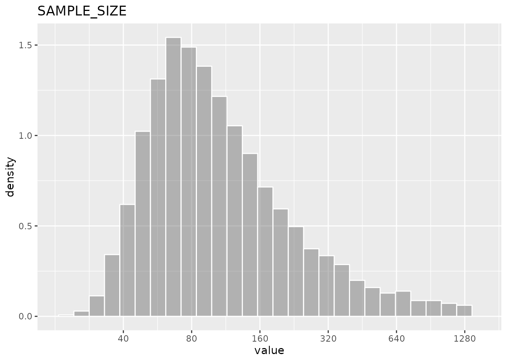
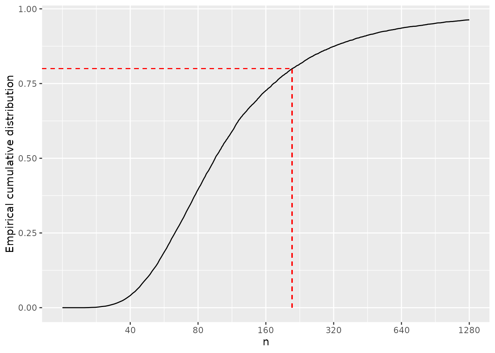

# Sample size with Uncertainty

## Introduction

This example show in details how to construct a new factory of
`DISTRIBUTION` objects using a convolution of parameters to propagate
the uncertainty to the final calculation.

The estimation of sample size require the input of different parameters
in a way that when the parameters are correct, the power to have a
significant result is correct. However many times there are some
uncertainty on the parameters and this is not reflected in the power.

The `convdist` package could help on explicitly express uncertainty on
those parameters and estimate the distribution of sample sizes that
would satisfy the power requirements of the assay.

We explore how to estimate the sample size for binomial outcome with
uncertainty and explain the details of how to construct a `DISTRIBUTION`
factory function.

## Sample size for a proportion

For an individually randomized trial, the number of subjects per group
could be defined as
$$n = \left( z_{\alpha/2} + z_{\beta} \right)^{2}\left\lbrack \pi_{0}\left( 1–\pi_{0} \right) + \pi_{1}(1–\pi 1) \right\rbrack/\left( \pi_{0}–\pi_{1} \right)^{2}$$

In this formula, $z_{\alpha/2}$ and $z_{\beta}$ are standard normal
distribution values corresponding to upper tail probabilities of
$z_{\alpha/2}$ and $z_{\beta}$ respectively. This choice of sample size
provides a power of 100(1 – $\beta$)% to obtaining a significant
difference ($P < \alpha$ on a two-sided test), assuming that the true
(population) proportion in presence or absence of the interventions are
$\pi_{1}$ and $\pi_{0}$ respectively

$\pi_{1}$ can be express on terms of $\pi_{0}$ as $\pi_{1} = \pi_{0}RR$
where $RR$ is the relative risk.

In the real world, there could be uncertainty on the exact values of
$\pi_{0}$ and $RR$ as they may come from previous studies or surveys.
What would be the distribution of $n$ if the uncertainty is taking into
account?

## A new `DISTRIBUTION` factory

We can construct a `DISTRIBUTION` object which would produce random
numbers taking into account the a probability distribution for $\pi_{0}$
and $RR$

See the code of `new_UNIFORM` function as an example of how is a factory
of `DISTRIBUTION` objects:

``` r
library(convdistr)
new_UNIFORM
#> function (p_min, p_max, p_dimnames = "rvar") 
#> {
#>     stopifnot(p_min <= p_max)
#>     .oval = (p_max + p_min)/2
#>     names(.oval) <- p_dimnames
#>     structure(list(distribution = "UNIFORM", seed = sample(1:2^15, 
#>         1), oval = .oval, rfunc = restrict_environment(function(n) {
#>         matrix(runif(n, p_min, p_max), ncol = 1, dimnames = list(1:n, 
#>             p_dimnames))
#>     }, p_min = p_min, p_max = p_max, p_dimnames = p_dimnames)), 
#>         class = c("UNIFORM", "DISTRIBUTION"))
#> }
#> <bytecode: 0x55799211b3a8>
#> <environment: namespace:convdistr>
```

The function should return an structure which consist of a list of four
named vector and a class attribute that should include “DISTRIBUTION”
The components of the list are:

**distribution** : A character with the name of the distribution
implemented. It is a good practice to use the same name also in the
class attribute

**seed** : A numerical seed that is use to get a repeatable sample in
the `summary` function Use a `sample` function to ensure each new object
will have a different seed

**oval** : The observed value. It is the value expected. It is used as a
number for the mathematical operations of the distributions as if they
were a simple scalar

**rfunc(n)** : A function that generate random numbers from the
distribution. Its only parameter `n` is the number of drawns of the
distribution. It returns a matrix with as many rows as `n`, and as many
columns as the dimensions of the distributions, The `rfunc` should be
defined within a `restrict_environment` function to ensure only the
variables required to the function are included in the environment of
the function. This will prevent *reference leaking* which could make the
objects big and slow when saved in a file.

The factory of object for the sample size of proportions could be
defined as:

``` r

#' Sample size for proportions, with uncertainty
#' 
#' Create an new DISTRIBUTION object that produce
#' random drawns of the estimated sample size for
#' two proportions
#' @param p0 a DISTRIBUTION object that drawns for proportions in control group
#' @param logrr a DISTRIBUTION object that drawns log(RR) of the intervention
#' @param alpha significant value
#' @param beta  1-power
new_SAMPLE_SIZE <- function(p0,logrr, alpha= 0.05, beta=0.2){
  #checkings
  stopifnot(inherits(p0,"DISTRIBUTION"))
  stopifnot(inherits(logrr,"DISTRIBUTION"))
  stopifnot(0 < alpha & alpha < 1)
  stopifnot(0 < beta & beta < 1)

 # function of alpha and beta
  f_alpha_beta <- (qnorm(alpha/2,lower.tail = F) + qnorm(beta, lower.tail = F)) ^ 2 
  
  # The expected value of the distribution with default name for the dimension
  # based on the oval value of the individual distributions  
  v0 <- p0$oval
  v1 <- p0$oval*exp(logrr$oval)
  
  # expected value of the distribution
  .oval <- f_alpha_beta * (v0 * (1 - v0) + v1 * (1 - v1)) / (v0 - v1) ^ 2
  names(.oval) <- "rvar"
    
  #random function within a restricted environment where only
  #the specified variables can be accesed within the function
  .rfunc <- restrict_environment(
     function(n) {
       d_p0 = rfunc_p0(n)
       d_p1 = d_p0 * exp(rfunc_logrr(n))
       fab * (d_p0 * (1 - d_p0) + d_p1 * (1 - d_p1)) / (d_p0 - d_p1) ^ 2
     },
     rfunc_p0 = p0$rfunc,
     rfunc_logrr = logrr$rfunc,
     fab = f_alpha_beta
  )
  # Create the object with 4 slots
  structure(
    list(
      distribution = "SAMPLE_SIZE",
      seed = sample(1:2 ^ 15, 1),
      oval = .oval,
      rfunc = .rfunc
    ), 
    class = c("SAMPLE_SIZE","DISTRIBUTION")
  )
  
}
```

## Using the Sample Size object

As example, suppose that the incidence of anaemia in children under 5
have been estimated from a survey as 35% with 95%CI (30%,40%), and a
prevention treatment that in other settings have shown to decrease
anaemia by 50% with 95%CI(8% to 73%).

We can define a `BETA` distribution based on the CI as

``` r
d_p0 = new_BETA_lci(0.35,0.30,0.40)
```

And a `NORMAL` distribution of the `log(RR)` as

``` r
rr = log(1 - 50/100)
sd = (log((1 - 8 / 100)) - log((1 - 73 / 100))) / 4
d_logrr = new_NORMAL(rr,sd)
```

So the input distributions are

| distribution | varname |  oval | nsample | mean\_ | sd\_ | lci\_ | median\_ | uci\_ |
|:-------------|:--------|------:|--------:|-------:|-----:|------:|---------:|------:|
| BETA         | rvar    |  0.35 |   10000 |   0.35 | 0.03 |  0.30 |     0.35 |  0.40 |
| NORMAL       | rvar    | -0.69 |   10000 |  -0.69 | 0.30 | -1.29 |    -0.69 | -0.11 |

And base on this we can calculate the distribution of samples with those
conditions

``` r
d_sample <- new_SAMPLE_SIZE(d_p0, d_logrr)
```

| distribution | varname | oval | nsample | mean\_ |     sd\_ | lci\_ | median\_ | uci\_ |
|:-------------|:--------|-----:|--------:|-------:|---------:|------:|---------:|------:|
| SAMPLE_SIZE  | rvar    |   95 |   10000 | 557654 | 49826919 |    37 |       96 |  2329 |



The oval value of the distribution give us the result we obtain from the
formula. With the conditions specified, a sample size of `95` is
required. However, the distribution is quite skewed as you can see the
mean and the median value are far, and the standard deviation very big.
This is because the sample size require for combinations of low efficacy
and low prevalence could be very large and there is no restriction on
how low could be the efficacy or the prevalence, which although have low
frequency, could happen in the simulations.

``` r
rdrawn <- rfunc(d_sample, 10000)
f_ecdf <- ecdf(rdrawn)
n_80 = trunc(uniroot(function(x){f_ecdf(x) - 0.8}, interval = c(10,10000))$root)
```

The empirical cumulative distribution values of a random sample of the
distribution show us that with `209` subjects per arm, 80% of the
possible scenarios are covered



## Enhance the Sample Size object

The function created above show us a distribution of sample size, but we
can’t inspect condition on which a particular drawn is obtained, *i.e.*
how low an prevalent anaemia value could be compensated with a high
efficacy value? To do that we could create a second object that have
drawns in several dimensions, the prevalence, the RR and the sample size
so we can make a graph with the three values.

``` r
#' Sample size for proportions, with uncertainty (V2)
#' 
#' Create an new DISTRIBUTION object that produce
#' random drawns of the estimated sample size for
#' two proportions as well as the samples from the parameters
#' @param p0 a DISTRIBUTION object that drawns for proportions in control group
#' @param logrr a DISTRIBUTION object that drawns log(RR) of the intervention
#' @param alpha significant value
#' @param beta  1-power
new_SAMPLE_SIZE2 <- function(p0,logrr, alpha= 0.05, beta=0.2){
  #checkings
  stopifnot(inherits(p0,"DISTRIBUTION"))
  stopifnot(inherits(logrr,"DISTRIBUTION"))
  stopifnot(0 < alpha & alpha < 1)
  stopifnot(0 < beta & beta < 1)

 # function of alpha and beta
  f_alpha_beta <- (qnorm(alpha/2,lower.tail = F) + qnorm(beta, lower.tail = F)) ^ 2 
  
  # The expected value of the distribution with default name for the dimension
  # based on the oval value of the individual distributions  
  v0 <- p0$oval
  v1 <- p0$oval*exp(logrr$oval)
  
  # expected value of the distribution
  ss <- f_alpha_beta * (v0 * (1 - v0) + v1 * (1 - v1)) / (v0 - v1) ^ 2
  .oval = c(p0$oval, exp(logrr$oval), ss)
  names(.oval) <- c('prevalence', 'rr', 'sample_size')
    
  #random function within a restricted environment where only
  #the specified variables can be accesed within the function
  .rfunc <- restrict_environment(
     function(n) {
       d_p0 = rfunc_p0(n)
       d_rr = exp(rfunc_logrr(n))
       d_p1 = d_p0 * d_rr
       d_ss = fab * (d_p0 * (1 - d_p0) + d_p1 * (1 - d_p1)) / (d_p0 - d_p1) ^ 2
       matrix(
         c(d_p0, d_rr, d_ss), 
         ncol = 3, 
         dimnames = list(1:n, c('prevalence','rr','sample_size')))
     },
     rfunc_p0 = p0$rfunc,
     rfunc_logrr = logrr$rfunc,
     fab = f_alpha_beta
  )
  # Create the object with 4 slots
  structure(
    list(
      distribution = "SAMPLE_SIZE2",
      seed = sample(1:2 ^ 15, 1),
      oval = .oval,
      rfunc = .rfunc
    ), 
    class = c("SAMPLE_SIZE2","DISTRIBUTION")
  )
  
}
```

``` r
d_sample2 <- new_SAMPLE_SIZE2(d_p0, d_logrr)
```

| distribution | varname     |  oval | nsample |   mean\_ |      sd\_ | lci\_ | median\_ |   uci\_ |
|:-------------|:------------|------:|--------:|---------:|----------:|------:|---------:|--------:|
| SAMPLE_SIZE2 | prevalence  |  0.35 |   10000 |     0.35 |      0.02 |  0.30 |     0.35 |    0.40 |
| SAMPLE_SIZE2 | rr          |  0.50 |   10000 |     0.52 |      0.17 |  0.27 |     0.50 |    0.92 |
| SAMPLE_SIZE2 | sample_size | 95.31 |   10000 | 11495.32 | 620764.71 | 37.19 |    94.28 | 2765.09 |

``` r
ss <- rfunc(d_sample2, 10000)
df <- data.frame(ss)
df$category = cut(df$sample_size, c(0,150,Inf),include.lowest = T, ordered_result = T)
head(df)
#>   prevalence        rr sample_size  category
#> 1  0.3554726 0.5017183    93.97889   [0,150]
#> 2  0.4006951 0.5789086   115.32163   [0,150]
#> 3  0.3622292 1.1916518   775.78095 (150,Inf]
#> 4  0.3442364 0.5121539   103.24103   [0,150]
#> 5  0.3668436 0.6721487   226.83723 (150,Inf]
#> 6  0.3881253 0.3722672    47.74573   [0,150]
```

The following graph shows the combination of options that would lead to
a sample size lower than 150 subjects


We see that under this particular set of conditions, it is possible to
have more than 80% power in all prevalence range provided the relative
risk is really lower than 50%.
