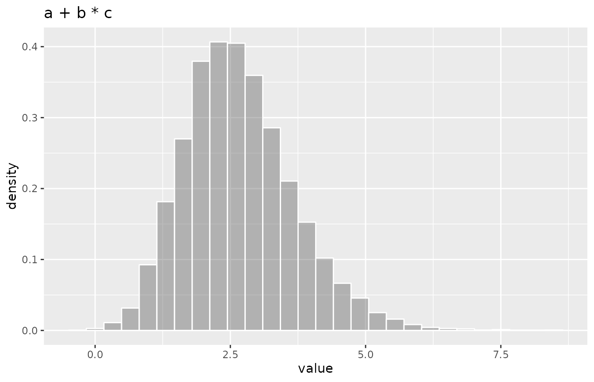
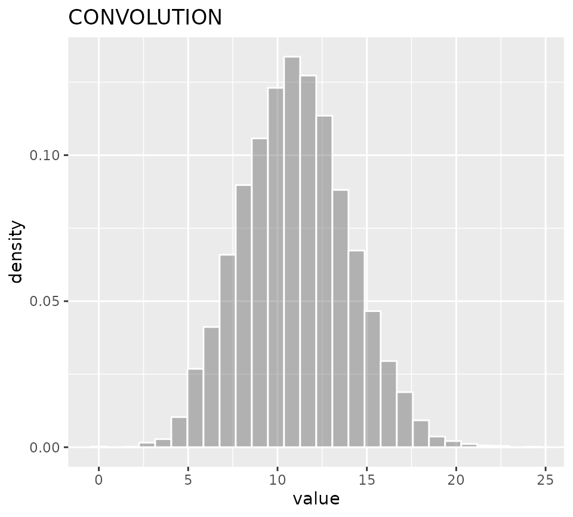

# Using the convdistr package

The `convdistr` package provide tools to define distribution objects and
make mathematical operations with them. It keep track of the results as
if they where scalar numbers but maintaining the ability to obtain
randoms samples of the convoluted distributions.

To install this package from github

`devtools::install_github("johnaponte/convdistr", build_manual = T, build_vignettes = T)`

## Practical example

What would be the resulting distribution of $a + b*c$ if $a$ is a
**normal** distribution with mean 1 and standard deviation 0.5, $b$ is a
**poisson** distribution with lambda 5 and $c$ is a **beta**
distribution with shape parameters 10 and 20?

``` r
library(convdistr)
library(ggplot2)

a <- new_NORMAL(1,0.5)
b <- new_POISSON(5)
c <- new_BETA(10,20)
res <- a + b * c

metadata(res) 
#>   distribution     rvar
#> 1  CONVOLUTION 2.666667
summary(res)
```

| distribution | varname | oval | nsample | mean\_ | sd\_ | lci\_ | median\_ | uci\_ |
|:-------------|:--------|-----:|--------:|-------:|-----:|------:|---------:|------:|
| CONVOLUTION  | rvar    | 2.67 |   10000 |   2.66 | 1.01 |  0.96 |     2.56 |  4.92 |

``` r
ggDISTRIBUTION(res) + ggtitle("a + b * c")
```



The result is a distribution with expected value 2.67. A sample from
10000 drawns of the distribution shows a mean value of 2.66, a median of
2.56 and 95% quantiles of 0.96, 4.92

The following sections describe the DISTRIBUTION object, how to create
new DISTRIBUTION objects and how to make operations and mixtures with
them.

Please note that when convoluting distributions, this package assumes
the distributions are independent between them, i.e. their correlation
is 0. If not, you need to implement specific distributions to handle the
correlation, like the MULTIVARIATE object.

## Description of the `DISTRIBUTION` object

The `DISTRIBUTION` is kind of abstract class (or interface) that
specific constructors should implement.

It contains 4 fields:

**distribution** : A character with the name of the distribution
implemented

**seed** : A numerical seed that is use to get a repeatable sample in
the `summary` function

**oval** : The observed value. It is the value expected. It is used as a
number for the mathematical operations of the distributions as if they
were a simple scalar

**rfunc(n)** : A function that generate random numbers from the
distribution. Its only parameter `n` is the number of drawns of the
distribution. It returns a matrix with as many rows as `n`, and as many
columns as the dimensions of the distributions

The DISTRIBUTION object can support multidimensional distributions for
example a dirichlet distribution. The names of the dimensions should
coincides with the names of the `oval` vector. If it has only one
dimension, the default name is `rvar`.

It is expected that the `rfunc` could be included in the creation of new
distributions by convolution or mixture, so the environment should be
carefully controlled to avoid reference leaking that is possible within
the R language. For that reason, the `rfunc` should be created within a
`restrict_environment` function that controls that only the variables
that are required within the `function` are saved in the environment of
the function.

Once the new objects are instanced, the fields are immutable and should
not be changed.

## Factory of `DISTRIBUTION` objects

The following functions create new objects of class `DISTRIBUTION`

| Distribution | factory         | parameters                   | function    |
|--------------|-----------------|------------------------------|-------------|
| uniform      | new_UNIFORM     | p_min, p_max                 | runif       |
| normal       | new_NORMAL      | p_mean, p_sd                 | rnorm       |
| beta         | new_BETA        | p_shape1, p_shape2           | rbeta       |
| beta         | new_BETA_lci    | p_mean, p_lci, p_uci         | rbeta       |
| triangular   | new_TRIANGULAR  | p_min, p_max, p_mode         | rtriangular |
| poisson      | new_POISSON     | p_lambda                     | rpoisson    |
| exponential  | new_EXPONENTIAL | p_rate                       | rexp        |
| discrete     | new_DISCRETE    | p_supp, p_prob               | sample      |
| dirichlet    | new_DIRICHLET   | p_alpha, p_dimnames          | rdirichlet  |
| truncated    | new_TRUNCATED   | p_distribution, p_min, p_max |             |
| dirac        | new_DIRAC       | p_value                      |             |
| NA           | new_NA          | p_dimnames                   |             |

## Methods

The following are methods for all objects of class `DISTRIBUTION`

- `metadata(x)` Print the metadata for the distribution
- `summary(object, n=10000)` Produce a summary of the distribution
- `rfunc(x, n)` Generate `n` random drawns of the distribution
- `plot(x, n= 10000)` Produce a density plot of the distribution
- `ggDISTRIBUTION(x, n= 10000)` produce a density plot of the
  distribution using ggplot2

``` r
myDistr <- new_NORMAL(0,1)
metadata(myDistr)
#>   distribution rvar
#> 1       NORMAL    0
rfunc(myDistr, 10)
#>           rvar
#> 1  -1.82340259
#> 2  -1.14762276
#> 3  -0.54868400
#> 4   1.17432834
#> 5   0.50286449
#> 6  -0.86745105
#> 7   0.01276699
#> 8  -0.51183777
#> 9  -1.20438751
#> 10  1.02704410
summary(myDistr)
```

| distribution | varname | oval | nsample | mean\_ | sd\_ | lci\_ | median\_ | uci\_ |
|:-------------|:--------|-----:|--------:|-------:|-----:|------:|---------:|------:|
| NORMAL       | rvar    |    0 |   10000 |  -0.01 |    1 | -1.94 |    -0.01 |  1.96 |

``` r
plot(myDistr)
```


Figure with R plot

``` r
ggDISTRIBUTION(myDistr)
```


Figure with ggplot2

## Convolution for Distribution with the same dimensions

Mathematical operations like `+`, `-`, `*`, `/` between `DISTRIBUTION`
with the same dimensions can be perform with the
`new_CONVOLUTION(listdistr, op, omit_NA = FALSE)` function. The
`listdistr` parameter is a list of `DISTRIBUTION` objects on which the
operation is made. A shorter version exists for each one of the
operations as follow

- `new_SUM(listdistr, omit_NA = FALSE)`
- `new_SUBTRACTION(listdistr, omit_NA = FALSE)`
- `new_MULTIPLICATION(listdistr, omit_NA = FALSE)`
- `new_DIVISION(listdistr, omit_NA = FALSE)`

but Mathematical operator can also be used.

``` r
d1 <- new_NORMAL(1,1)
d2 <- new_UNIFORM(2,8)
d3 <- new_POISSON(5)
dsum <- new_SUM(list(d1,d2,d3))
dsum
#>   distribution rvar
#> 1  CONVOLUTION   11
d1 + d2 + d3
#>   distribution rvar
#> 1  CONVOLUTION   11
summary(dsum)
```

| distribution | varname | oval | nsample | mean\_ | sd\_ | lci\_ | median\_ | uci\_ |
|:-------------|:--------|-----:|--------:|-------:|-----:|------:|---------:|------:|
| CONVOLUTION  | rvar    |   11 |   10000 |  10.97 | 2.99 |  5.42 |    10.86 | 17.03 |

``` r
ggDISTRIBUTION(dsum)
```



## Mixture

A `DISTRIBUTION`, consisting on the mixture of several distribution can
be obtained with the `new_MIXTURE(listdistr, mixture)` function where
`listdistr` is a list of `DISTRIBUTION` objects and `mixture` the vector
of probabilities for each distribution. If missing the mixture, the
probability will be the same for each distribution.

``` r
d1 <- new_NORMAL(1,0.5)
d2 <- new_NORMAL(5,0.5)
d3 <- new_NORMAL(10,0.5)
dmix <- new_MIXTURE(list(d1,d2,d3))
summary(dmix)
```

| distribution | varname | oval | nsample | mean\_ | sd\_ | lci\_ | median\_ | uci\_ |
|:-------------|:--------|-----:|--------:|-------:|-----:|------:|---------:|------:|
| MIXTURE      | rvar    | 5.33 |   10000 |   5.31 | 3.71 |  0.29 |     4.97 | 10.73 |

``` r
ggDISTRIBUTION(dmix)
```


## Convolution of distributions with different dimensions

When convoluting distribution with different dimensions, there are two
possibilities. The `new_CONVOLUTION_assoc` family of functions perform
the operation only on the common dimensions and left the others
dimensions as they are, or the `new_CONVOLUTION_comb` family of
functions which perform the operation in the combination of all
dimensions.

``` r
d1 <- new_MULTINORMAL(c(0,1), matrix(c(1,0.3,0.3,1), ncol = 2), p_dimnames = c("A","B"))
d2 <- new_MULTINORMAL(c(3,4), matrix(c(1,0.3,0.3,1), ncol = 2), p_dimnames = c("B","C"))
summary(d1)
```

| distribution | varname | oval | nsample | mean\_ | sd\_ | lci\_ | median\_ | uci\_ |
|:-------------|:--------|-----:|--------:|-------:|-----:|------:|---------:|------:|
| MULTINORMAL  | A       |    0 |   10000 |  -0.01 | 0.99 | -1.96 |    -0.02 |  1.94 |
| MULTINORMAL  | B       |    1 |   10000 |   1.02 | 1.01 | -0.95 |     1.02 |  3.01 |

``` r
summary(d2)
```

| distribution | varname | oval | nsample | mean\_ | sd\_ | lci\_ | median\_ | uci\_ |
|:-------------|:--------|-----:|--------:|-------:|-----:|------:|---------:|------:|
| MULTINORMAL  | B       |    3 |   10000 |   3.00 | 1.01 |  1.05 |     3.00 |  4.98 |
| MULTINORMAL  | C       |    4 |   10000 |   4.01 | 1.00 |  2.07 |     4.01 |  5.98 |

``` r
summary(new_SUM_assoc(d1,d2))
```

| distribution | varname | oval | nsample | mean\_ | sd\_ | lci\_ | median\_ | uci\_ |
|:-------------|:--------|-----:|--------:|-------:|-----:|------:|---------:|------:|
| CONVOLUTION  | A       |    0 |   10000 |   0.00 | 1.00 | -1.96 |     0.01 |  1.95 |
| CONVOLUTION  | C       |    4 |   10000 |   3.99 | 0.99 |  2.04 |     3.98 |  5.95 |
| CONVOLUTION  | B       |    4 |   10000 |   4.01 | 1.42 |  1.17 |     4.00 |  6.85 |

``` r
summary(new_SUM_comb(d1,d2))
```

| distribution | varname | oval | nsample | mean\_ | sd\_ | lci\_ | median\_ | uci\_ |
|:-------------|:--------|-----:|--------:|-------:|-----:|------:|---------:|------:|
| CONVOLUTION  | A_B     |    3 |   10000 |   3.00 | 1.40 |  0.29 |     2.99 |  5.76 |
| CONVOLUTION  | B_B     |    4 |   10000 |   3.99 | 1.41 |  1.21 |     3.99 |  6.74 |
| CONVOLUTION  | A_C     |    4 |   10000 |   4.00 | 1.40 |  1.24 |     4.00 |  6.73 |
| CONVOLUTION  | B_C     |    5 |   10000 |   4.99 | 1.42 |  2.16 |     5.02 |  7.72 |
